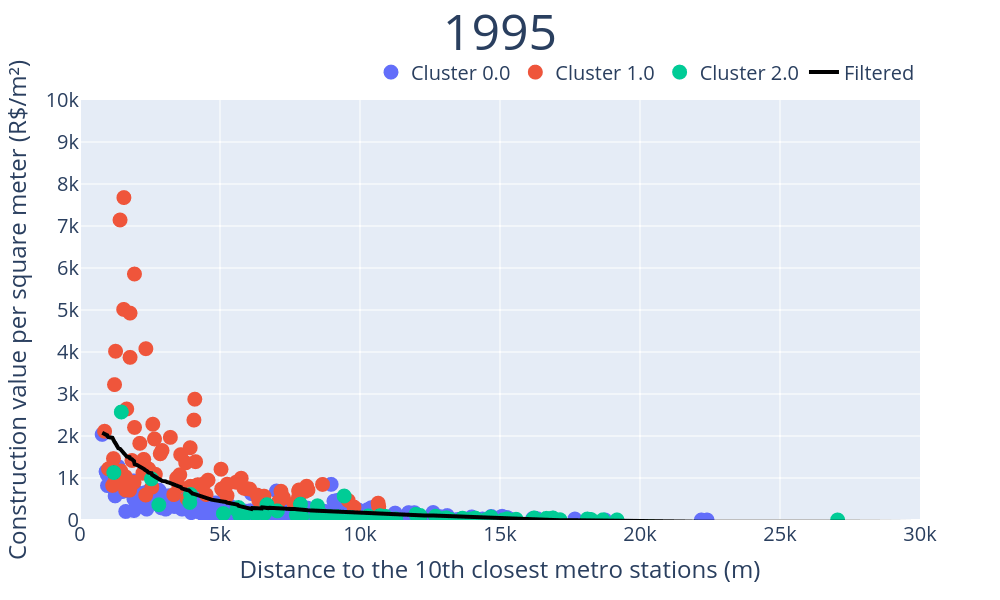
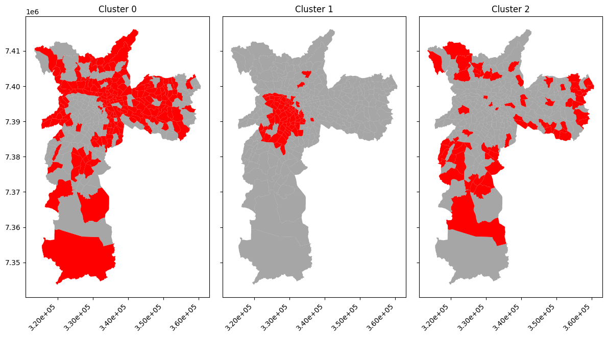
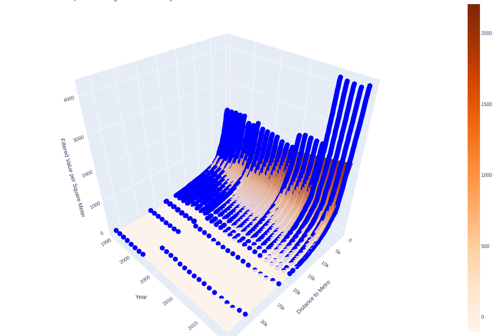

# Metro Impact on Property Value in São Paulo

This repository contains the code and data for the research project "Metro Impact on the Property Value of Surrounding Areas: A Case Study in São Paulo, Brazil".
This study investigates the influence of metro networks on property values in São Paulo, utilizing spatial econometric methods and data analysis.

  
  

  

  

## Overview

The project examines how proximity to metro networks affects residential property values in São Paulo, Brazil. It leverages extensive property tax (IPTU) data and real estate valuation data from 1995 to the present, using spatial econometric techniques.

## Repository Structure

- `notebooks/` - Contains all source code used for data analysis and visualization.
- `data/` - Includes datasets used in the study. Due to privacy or size, some data might be excluded.
- `latex-project/` - Use this to either build or visualize the pdf manuscript with LaTeX.
- `presentations/` - The .pptx of the 2 presentations made during the course.

## Getting Started

To replicate the analysis, follow these steps:

1. Clone the repository: `git clone https://github.com/Gui-FernandesBR/MetroImpactOnPropertyValues.git`
2. Install required dependencies: `pip install -r requirements.txt`
3. Start running the analysis saved in the `notebooks` folder

## Dependencies

List of main libraries and tools used in the project:

- Python 3.8 or above (built using 3.10)
- geopandas
- scikit-learn
- plotly
- openpyxl
- kaleido
- kneed
- vaex

## Data Sources

The primary data sources include:

- São Paulo IPTU data (1995-present)
- Spatial data from São Paulo Metro Company

Data privacy and usage terms are respected as per the source guidelines.

## Contributing

We welcome contributions to this project! Please read `CONTRIBUTING.md` for details on our code of conduct and the process for submitting pull requests.

## Authors

- **Guilherme F. Alves** - [Gui-FernandesBR](https://github.com/Gui-FernandesBR)

## License

This project is licensed under the GPL License - see the `LICENSE.md` file for details.

## Acknowledgments

- Professor Mariana Giannotti for supervising the research project.
- Fernando Gomes for the remarkable work on [this repo](https://github.com/cem-usp/dash-iptu)

## Citation

If you use the data, code, or methodology from this project in your research, please cite: TBD
